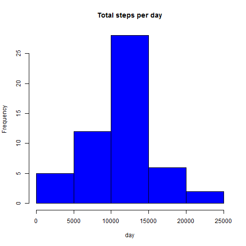
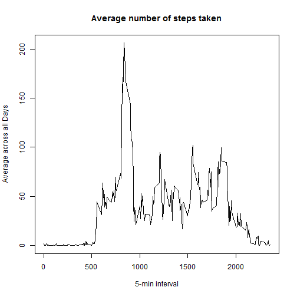
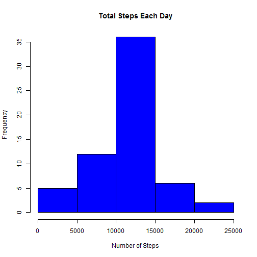
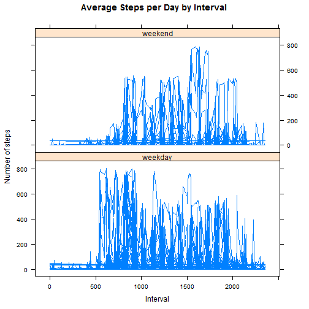

Reproducible Research: Peer Assessment 1

```r
library(lattice)
library(scales)
library(Hmisc)
```
Loading and preprocessing the data

1. Load activity data using read.csv()


```r
if(!file.exists('activity.csv')){
    unzip('activity.zip')
}
activityData <- read.csv('activity.csv')
```

2. Process/transform the data (if necessary) into a format suitable for  analysis


```r
activityData$date <- as.Date(activityData$date, "%Y-%m-%d")
```

What is mean total number of steps taken per day?

1. Calculate the total number of steps taken per day

```r
totalSteps <- aggregate(steps ~ date, data = activityData, sum, na.rm = TRUE)
```
2. Make a histogram of the total number of steps taken each day

```r
hist(totalSteps$steps, main = "Total steps per day", xlab = "day", col = "blue")
```

 

3. Calculate and report the mean and median total number of steps taken per day

```r
mean(totalSteps$steps)
```

```
## [1] 10766.19
```

```r
median(totalSteps$steps)
```

```
## [1] 10765
```


What is the average daily activity pattern?


1. Make a time series plot (i.e. type = "l") of the 5-minute interval (x-axis) and the average number of steps taken, averaged across all days (y-axis)


```r
time_series <- aggregate(steps ~ interval, activityData, mean)
plot(time_series$interval,time_series$steps, type="l", xlab="5-min interval", ylab="Average across all Days",main="Average number of steps taken")
```

 

2. Which 5-minute interval, on average across all the days in the dataset, contains the maximum number of steps?


```r
max_interval <- time_series[which.max(time_series$steps),1]
```
The 5-minute interval, on average across all the days in the data set, containing the maximum number of steps is 835


Imputing missing values

1. Calculate and report the total number of missing values in the dataset


```r
activity_NA <- sum(is.na(activityData))
```

The total number of rows with NA's is 2304

2. Devise a strategy for filling in all of the missing values in the dataset. 

The strategy is to use the mean value to filling of all missing values.


3. Create a new dataset that is equal to the original dataset but with the missing data filled in.


```r
activityDataImputed <- activityData
activityDataImputed$steps <- impute(activityData$steps, fun=mean)
```

4. Make a histogram of the total number of steps taken each day


```r
stepsByDayImputed <- tapply(activityDataImputed$steps, activityDataImputed$date, sum)
hist(stepsByDayImputed, main = paste("Total Steps Each Day"), col="blue", xlab="Number of Steps")
```

 

... and Calculate and report the mean and median total number of steps taken per day.


```r
stepsByDayMeanImputed <- mean(stepsByDayImputed)
stepsByDayMedianImputed <- median(stepsByDayImputed)
```

The imputed data mean is 1.0766189 &times; 10<sup>4</sup>
The imputed data median is 1.0766189 &times; 10<sup>4</sup>

After replacing the mean is the same but the median is a little bit different


Are there differences in activity patterns between weekdays and weekends?

1. Create a new factor variable in the dataset with two levels - "weekday" and "weekend" indicating whether a given date is a weekday or weekend day.


```r
activityDataImputed$dateType <-  ifelse(as.POSIXlt(activityDataImputed$date)$wday %in% c(0,6), 'weekend', 'weekday')
```

2. Make a panel plot containing a time series plot


```r
xyplot(activityDataImputed$steps ~ activityDataImputed$interval|activityDataImputed$dateType, main="Average Steps per Day by Interval",xlab="Interval", ylab="Number of steps",layout=c(1,2), type="l")
```

 
